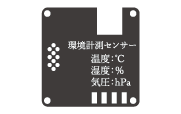
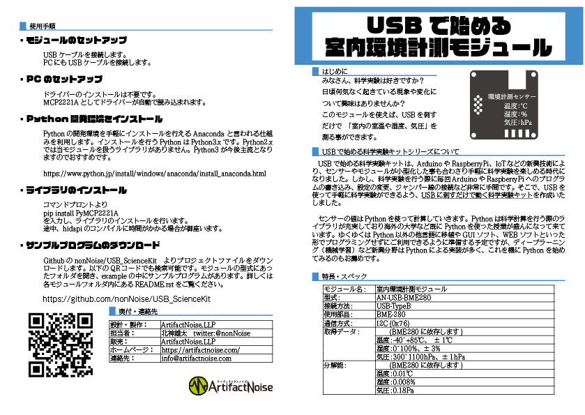
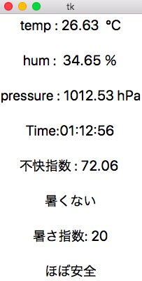

========================================================================
温度／湿度／気圧を計測する　室内環境計測モジュール
========================================================================

作成日:2018/05/01

■ 概要
------------------------------------------------------------------------

大気中の温度／湿度／気圧　を計測します。

■ 回路図
------------------------------------------------------------------------

.. image:: ./eagle/BME280.PNG
    :width: 480px

■ 部品表
------------------------------------------------------------------------

:MCP2221A [I-13069]: http://akizukidenshi.com/catalog/g/gI-13069/
:ICソケット(14P) [P-00006]: http://akizukidenshi.com/catalog/g/gP-00006/
:基板取付用ＵＳＢコネクタ（Ｂタイプ　メス）[C-00161]: http://akizukidenshi.com/catalog/g/gC-00161/
:LED [I-02754]: http://akizukidenshi.com/catalog/g/gI-02754/
:ポリスイッチ [P-12911]: http://akizukidenshi.com/catalog/g/gP-12911/
:抵抗: 10KΩ、470Ω
:コンデンサ: 0.1uF
:BME280 [K-09421]: http://akizukidenshi.com/catalog/g/gK-09421/

■ ライブラリインストール
------------------------------------------------------------------------

pip install PyMCP2221A

|

|

■ サンプルプログラム
------------------------------------------------------------------------

コマンドライン
^^^^^^^^^^^^^^^^^^^^^^^^^^^^^^^^^^^^^^^^^^^^^^^^^^^^^^^^^^^^^^^^^^^^^^^^

    https://github.com/nonNoise/USB_ScienceKit/blob/master/AN-USB-BME280/example/BME280_test.py

-   初期化
    
    from PyMCP2221A import BME280
    
    device = BME280.BME280()

-   全てのデータ読出し

    device.readData()

-   温度値の関数 [℃]

    device.temperature

-   湿度値の関数 [%]

    device.humidity

    ※ device.var_h　は古い関数で使用しない方向でおねがいします。 

-   気圧値の関数　[pa]

    device.pressure

※ヘクトパスカル(hPa)に変換する際は　device.pressure/100 をします。

GUIアプリ
^^^^^^^^^^^^^^^^^^^^^^^^^^^^^^^^^^^^^^^^^^^^^^^^^^^^^^^^^^^^^^^^^^^^^^^^

https://github.com/nonNoise/USB_ScienceKit/blob/master/AN-USB-BME280/example/BME280_GUI.py

KivyによるGUIアプリ
^^^^^^^^^^^^^^^^^^^^^^^^^^^^^^^^^^^^^^^^^^^^^^^^^^^^^^^^^^^^^^^^^^^^^^^^
okajun35様より、Kivyで動くサンプルプログラムを頂きました！　有難うございます！！

https://github.com/okajun35/AN-USB-BME280

.. raw:: html

    <blockquote class="twitter-video" data-lang="ja">
技術書典４で買った<a href="https://twitter.com/nonNoise?ref_src=twsrc%5Etfw">@nonNoise</a>の温度センサー。これはすごい！！ ドライバーのインストールも簡単でなによりPythonで値が取得できる。 ラズパイよりも全然簡単なのでおすすめ。<a href="https://twitter.com/hashtag/%E6%8A%80%E8%A1%93%E6%9B%B8%E5%85%B8?src=hash&amp;ref_src=twsrc%5Etfw">#技術書典</a>　<a href="https://twitter.com/hashtag/%E6%8A%80%E8%A1%93%E6%9B%B8%E5%85%B84?src=hash&amp;ref_src=twsrc%5Etfw">#技術書典4</a> <a href="https://t.co/A5dq0sgeG1">pic.twitter.com/A5dq0sgeG1</a>
&mdash; okazaki jun (@dario_okazaki) <a href="https://twitter.com/dario_okazaki/status/988445093907415041?ref_src=twsrc%5Etfw">2018年4月23日</a></blockquote>
    

■ 参考資料
------------------------------------------------------------------------

::
    
    MIT License
    Copyright (c) 2018 ArtifactNoise,LLP/Yuta Kitagami   
