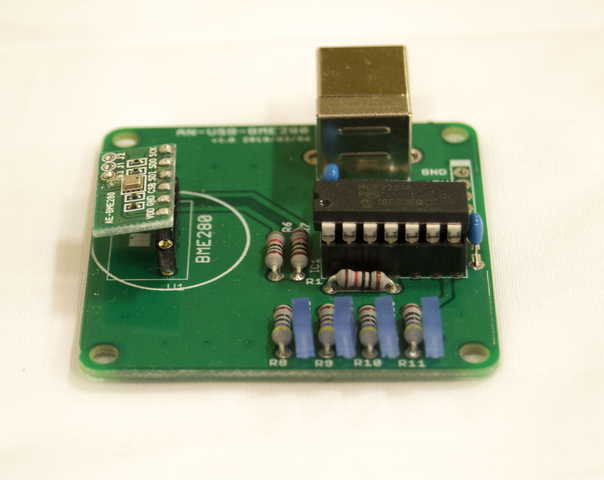

========================================================================
温度／湿度／気圧を計測する　室内環境計測モジュール
========================================================================

作成日:

■ 概要
------------------------------------------------------------------------

大気中の温度／湿度／気圧　を計測します。

■ 回路図
------------------------------------------------------------------------

.. image:: ./eagle/BME280.PNG
    :width: 480px

■ 部品表
------------------------------------------------------------------------

:MCP2221A [I-13069]: http://akizukidenshi.com/catalog/g/gI-13069/
:ICソケット(14P) [P-00006]: http://akizukidenshi.com/catalog/g/gP-00006/
:基板取付用ＵＳＢコネクタ（Ｂタイプ　メス）[C-00161]: http://akizukidenshi.com/catalog/g/gC-00161/
:LED [I-02754]: http://akizukidenshi.com/catalog/g/gI-02754/
:ポリスイッチ [P-12911]: http://akizukidenshi.com/catalog/g/gP-12911/
:抵抗: 10KΩ、470Ω
:コンデンサ: 0.1uF
:BME280 [K-09421]: http://akizukidenshi.com/catalog/g/gK-09421/

■ サンプルプログラム
------------------------------------------------------------------------

    pip install PyMCP2221A

    https://github.com/nonNoise/USB_ScienceKit/blob/master/BME280/example/BME280_test.py

-   初期化
    
    from PyMCP2221A import BME280
    
    device = BME280.BME280()

-   全てのデータ読出し

    device.readData()

-   温度値の関数 [℃]

    device.temperature

-   湿度値の関数 [%]

    device.var_h

-   気圧値の関数　[pa]

    device.pressure

※ヘクトパスカル(hPa)に変換する際は　device.pressure/100 をします。

■ 参考資料
------------------------------------------------------------------------

::
    
    MIT License
    Copyright (c) 2018 ArtifactNoise,LLP/Yuta Kitagami   
