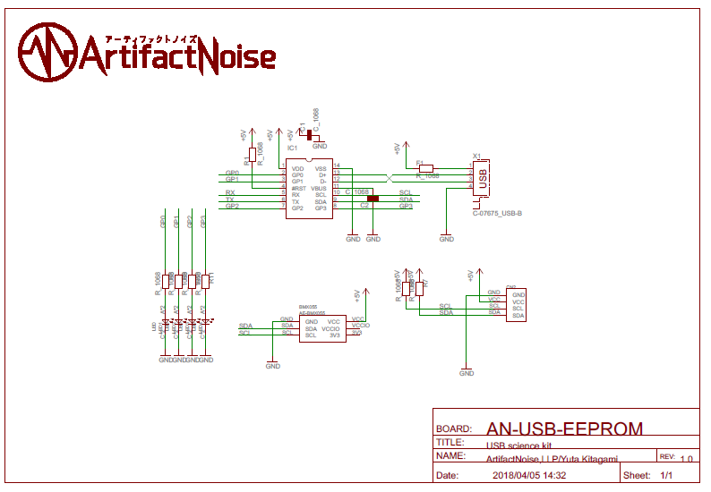

========================================================================
９軸加速度センサー　モジュール
========================================================================

作成日:

.. image:: 
    :width: 480px

■ 概要
------------------------------------------------------------------------

USBで９軸加速度を検出する事が出来ます。

■ 回路図
------------------------------------------------------------------------

■ ライブラリインストール
------------------------------------------------------------------------

git clone https://github.com/nonNoise/USB_StartUpModule.git

pip install PyMCP2221A

cd ./USB_StartUpModule/AN-USB-BMX055/example

python3  BMX055_test.py

■ サンプルプログラム
------------------------------------------------------------------------

コマンドライン
^^^^^^^^^^^^^^^^^^^^^^^^^^^^^^^^^^^^^^^^^^^^^^^^^^^^^^^^^^^^^^^^^^^^^^^^

    ９軸のデータを取得しましす。

    https://github.com/nonNoise/USB_StartUpModule/blob/master/AN-USB-BMX055/example/BMX055_test.py

-   初期化

    from PyMCP2221A import PyMCP2221A

    import BMX055

    bmx055 = BMX055.BMX055()

    bmx055.setup()

-   加速度値の取得 (X , Y , Z) [g]

    bmx055.GetAcclData()

-   ジャイロ値の取得 (X , Y , Z) [g]

    bmx055.GetGyroData()

-   磁気値の取得 (X , Y , Z) 

    bmx055.GetMegData()

■ 参考資料
------------------------------------------------------------------------

-   姿勢制御

    https://ja.wikipedia.org/wiki/%E5%A7%BF%E5%8B%A2%E5%88%B6%E5%BE%A1

-   ロボットのための慣性計測装置(IMU)入門

    https://myenigma.hatenablog.com/entry/2015/11/09/183738

-   ロボットの位置推定におけるクォータニオン

    https://myenigma.hatenablog.com/entry/20130719/1374304154

::
    
    MIT License
    Copyright (c) 2018 ArtifactNoise,LLP/Yuta Kitagami   
