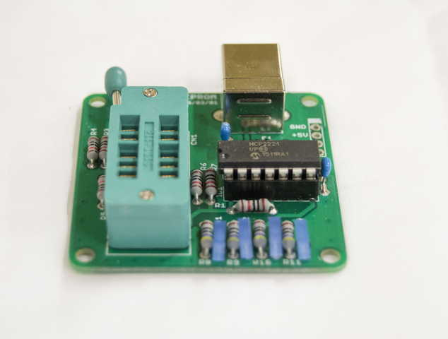

========================================================================
I2C EEPROMリードライタ―　モジュール
========================================================================

作成日:

■ 概要
------------------------------------------------------------------------

USBでI2CタイプのEEPROMをリードライトする事が出来ます。

■ 回路図
------------------------------------------------------------------------

.. image:: ./img/EEPROM.PNG
    :width: 480px

■ サンプルプログラム
------------------------------------------------------------------------

    pip install PyMCP2221A

■ 参考資料
------------------------------------------------------------------------

::
    
    MIT License
    Copyright (c) 2018 ArtifactNoise,LLP/Yuta Kitagami   
