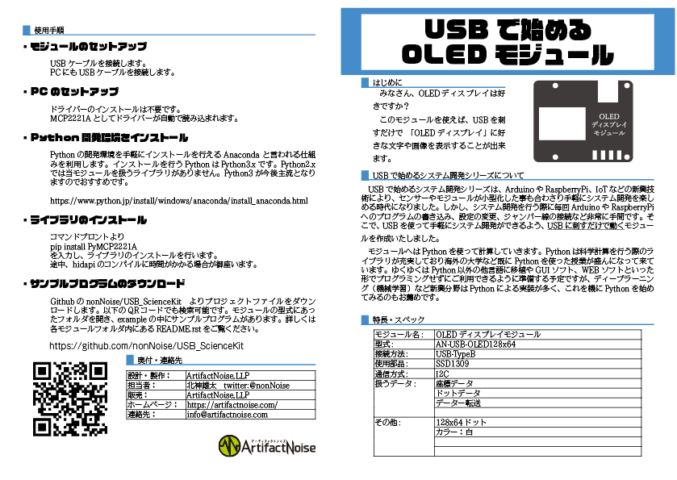

========================================================================
０．９６インチ OLED表示モジュール
========================================================================

作成日:2018/05/01

■ 概要
------------------------------------------------------------------------

USBで０．９６インチのＯＬＥＤに文字や図を表示が出来ます。

■ 回路図
------------------------------------------------------------------------

.. image:: ./img/OLED-Mini.PNG
    :width: 480px

■ 部品表
------------------------------------------------------------------------

:MCP2221A [I-13069]: http://akizukidenshi.com/catalog/g/gI-13069/
:ICソケット(14P) [P-00006]: http://akizukidenshi.com/catalog/g/gP-00006/
:基板取付用ＵＳＢコネクタ（Ｂタイプ　メス）[C-00161]: http://akizukidenshi.com/catalog/g/gC-00161/
:LED [I-02754]: http://akizukidenshi.com/catalog/g/gI-02754/
:ポリスイッチ [P-12911]: http://akizukidenshi.com/catalog/g/gP-12911/
:抵抗: 10KΩ、470Ω
:コンデンサ: 0.1uF
:OLEDディスプレイ[P-12031]: http://akizukidenshi.com/catalog/g/gP-12031/

■ ライブラリインストール
------------------------------------------------------------------------

git clone https://github.com/nonNoise/USB_StartUpModule.git

pip install PyMCP2221A

pip install Pillow

cd ./USB_StartUpModule/AN-USB-OLED-MINI/example

■ サンプルプログラム
------------------------------------------------------------------------

コマンドライン
^^^^^^^^^^^^^^^^^^^^^^^^^^^^^^^^^^^^^^^^^^^^^^^^^^^^^^^^^^^^^^^^^^^^^^^^

    https://github.com/nonNoise/USB_StartUpModule/blob/master/AN-USB-OLED-MINI/example/AKI_SPI_AQM1248A.py

-   初期化
    

-   フォント設定

-   座標と文字指定

-   画面書き出し

-   画面クリア

■ 参考資料
------------------------------------------------------------------------

::
    
    MIT License
    Copyright (c) 2018 ArtifactNoise,LLP/Yuta Kitagami   
