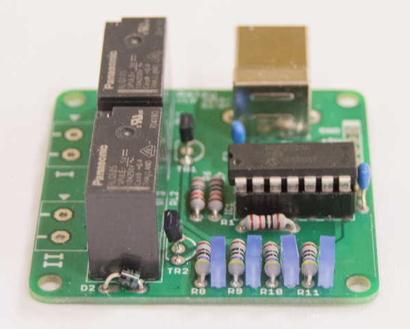

========================================================================
リレー制御モジュール
========================================================================

作成日:

■ 概要
------------------------------------------------------------------------

USBでリレーと制御することが出来ます。

■ 回路図
------------------------------------------------------------------------

.. image:: ./eagle/Relay.PNG
    :width: 480px

■ 部品表
------------------------------------------------------------------------

:MCP2221A [I-13069]: http://akizukidenshi.com/catalog/g/gI-13069/
:ICソケット(14P) [P-00006]: http://akizukidenshi.com/catalog/g/gP-00006/
:基板取付用ＵＳＢコネクタ（Ｂタイプ　メス）[C-00161]: http://akizukidenshi.com/catalog/g/gC-00161/
:LED [I-02754]: http://akizukidenshi.com/catalog/g/gI-02754/
:ポリスイッチ [P-12911]: http://akizukidenshi.com/catalog/g/gP-12911/
:抵抗: 10KΩ、470Ω
:コンデンサ: 0.1uF
:デジタルトランジスタ [I-12467]: http://akizukidenshi.com/catalog/g/gI-12467/
:ショットキーダイオード [I-08997]: http://akizukidenshi.com/catalog/g/gI-08997/
:リレー [P-09148]: http://akizukidenshi.com/catalog/g/gP-09148/
:ターミナルブロック[P-01309]: http://akizukidenshi.com/catalog/g/gP-01309/

■ サンプルプログラム
------------------------------------------------------------------------

    pip install PyMCP2221A

■ 参考資料
------------------------------------------------------------------------

::
    
    MIT License
    Copyright (c) 2018 ArtifactNoise,LLP/Yuta Kitagami   
