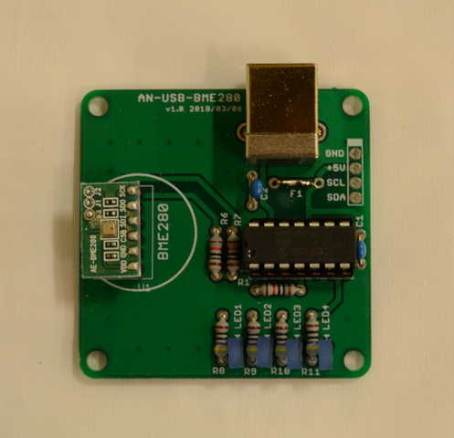
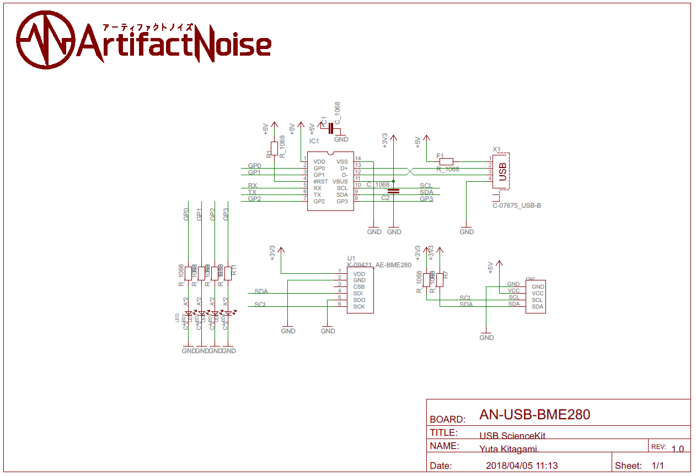

========================================================================
温度／湿度／気圧を計測する　室内環境計測モジュール
========================================================================

作成日:

■ 概要
------------------------------------------------------------------------

大気中の温度／湿度／気圧　を計測します。

■ 回路図
------------------------------------------------------------------------

■ サンプルプログラム
------------------------------------------------------------------------

    pip install PyMCP2221A

    https://github.com/nonNoise/USB_ScienceKit/blob/master/BME280/example/BME280_test.py

■ 参考資料
------------------------------------------------------------------------

::
    
    MIT License
    Copyright (c) 2018 ArtifactNoise,LLP/Yuta Kitagami   
